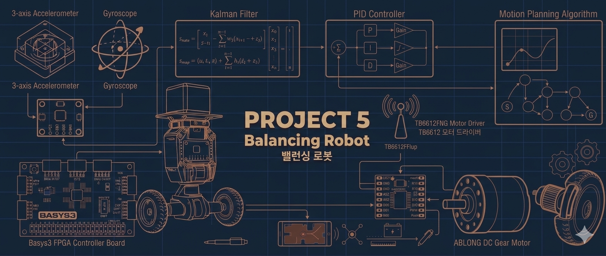
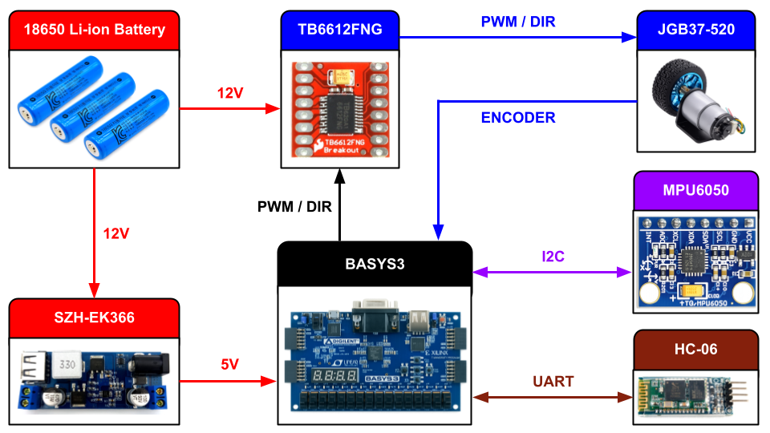
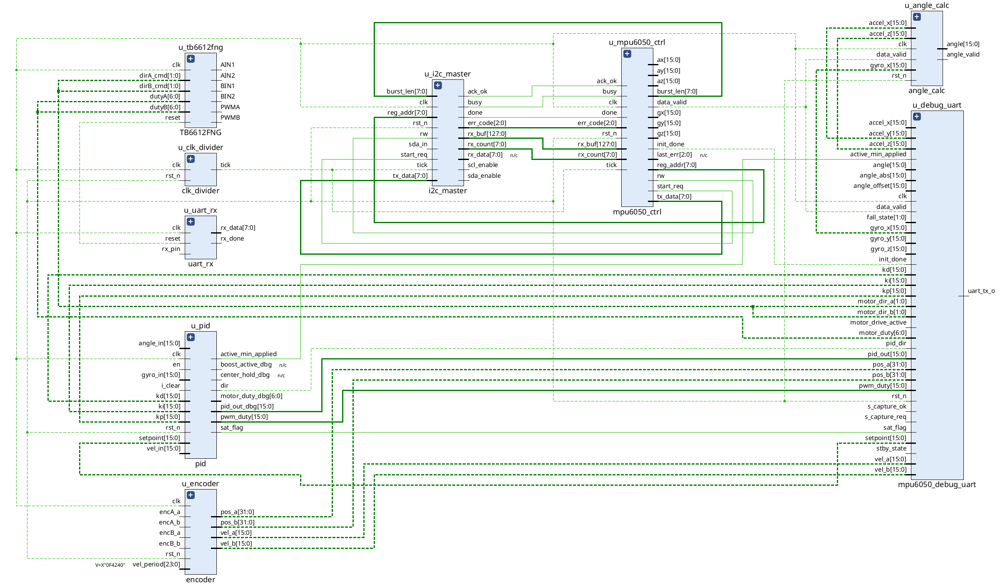
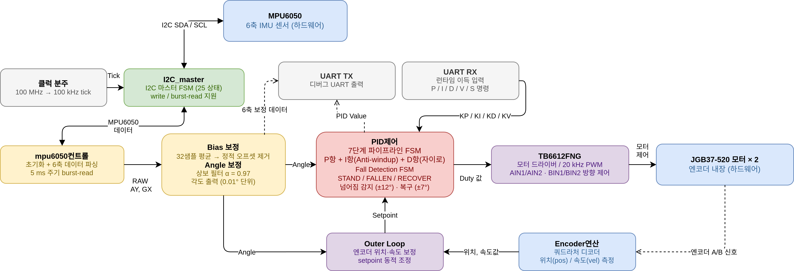
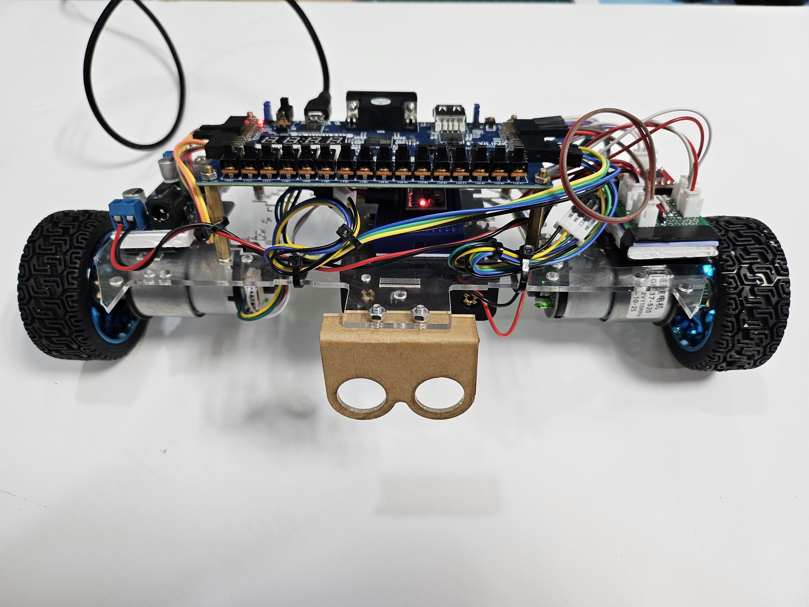
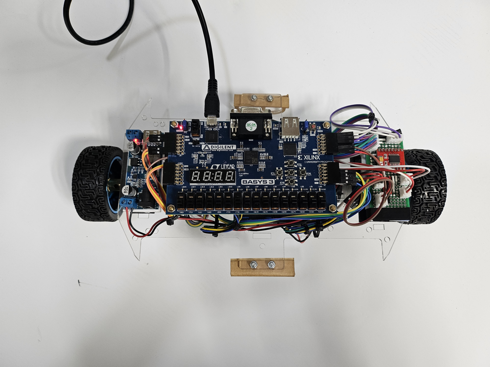
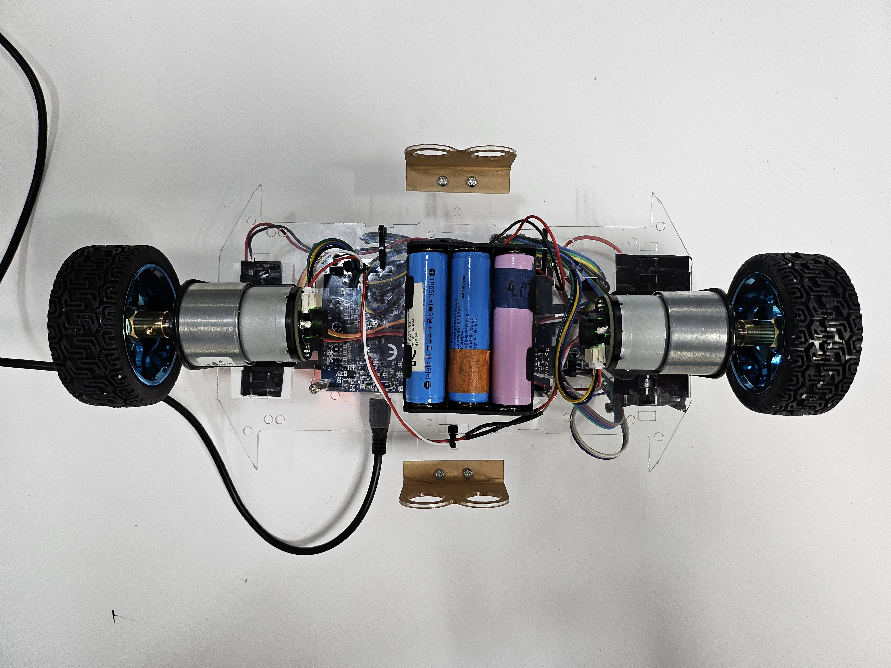
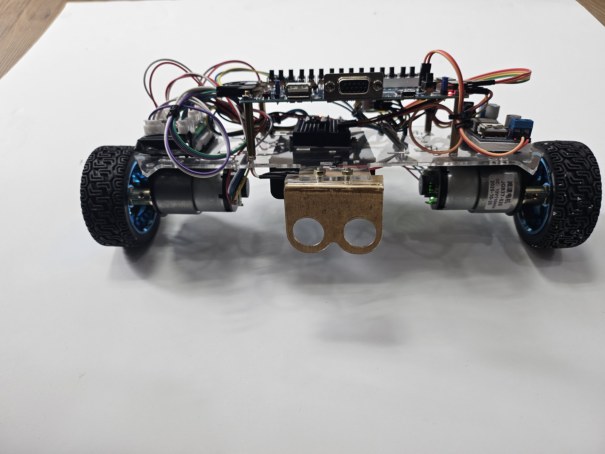
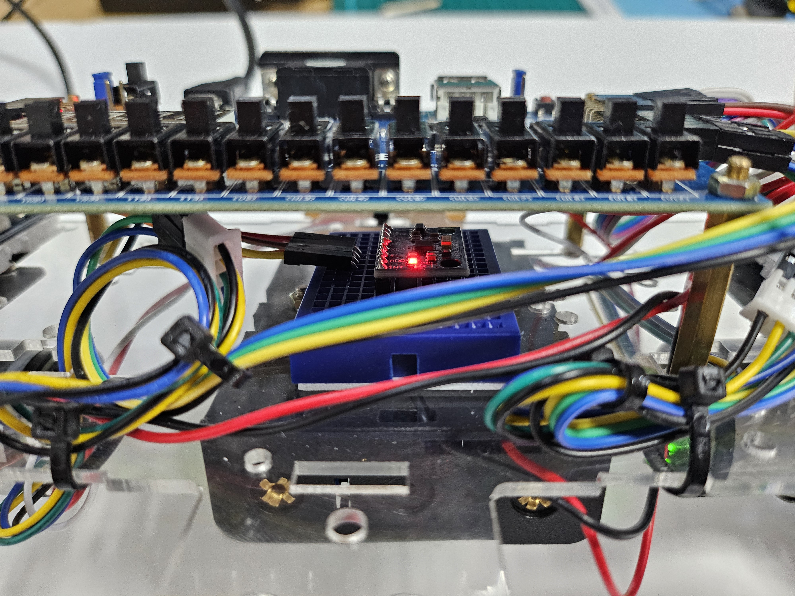
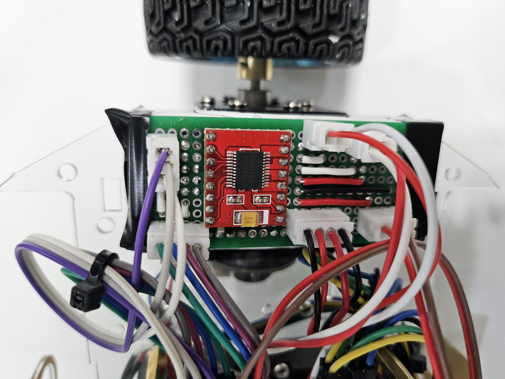

# 🤖 Project 5 Balancing Robot

## **1. Project Summary (프로젝트 요약)**
Basys3(Artix-7 FPGA)와 Encoder가 있는 Gear DC 모터(JGB37-520)를 활용하여  밸런싱 로봇 제작


## 2. Key Features (주요 기능)

### ⚖️ 밸런싱 기능
- PID 제어를 통한 밸런싱 로봇의 균형잡기
- UART와 Bluetooth를 통한 원격 PID 튜닝


## 🛠 3.  Tech Stack (기술 스택)


### 3.1 Language (사용언어)


### 3.2 Development Environment (개발 환경)
|  |  |
| :---: | :---: |
| **AMD Vivado** | **VS code** |

### 3.3 Collaboration Tools (협업 도구)


## 📂 4.  Project Structure (프로젝트 구조)

### 4.1 Project Tree (프로젝트 트리)

```
Project_5_Balancing-Robot/
├── Balacing_Robot.srcs/                # 핵심 하드웨어 설계 소스 및 제약 파일
│   ├── constrs_1/
│   │   └── imports/
│   │       └── fpga/
│   │           └── Basys-3-Master.xdc  # Basys3 보드 핀 할당 및 물리 제약 파일
│   └── sources_1/
│       └── new/                        # Verilog HDL 설계 소스 코드 (.v)
│           ├── top.v                   # 시스템을 통합하는 최상위 메인 제어 모듈
│           ├── pid.v                   # 로봇 균형 제어용 핵심 PID 알고리즘
│           ├── angle_calc.v            # 원시 센서 데이터 기반 기울기 각도 산출
│           ├── mpu6050_ctrl.v          # MPU6050 자이로 및 가속도 센서 제어기
│           ├── mpu6050_debug_uart.v    # 10진수 변환 및 디버깅용 UART 출력 로직
│           ├── encoder.v               # 홀 엔코더 신호 분석 및 바퀴 속도 측정
│           ├── TB6612FNG.v             # DC 기어 모터 제어용 PWM 및 방향 신호 생성
│           ├── i2c_master.v            # 센서 데이터 수집용 I2C 마스터 프로토콜
│           ├── uart_bluetooth.v        # 조종기 블루투스 제어 명령 수신 및 디코더
│           └── clk_divider.v           # 시스템 타이밍 동기화용 클럭 분주기
├── Balacing_Robot.tcl                  # Vivado 프로젝트 환경 자동 복원 스크립트
├── README.md                           # 프로젝트 전체 개요 및 빌드 가이드 문서
├── REPORT.md                           # 실험 과정, 트러블슈팅 및 결과 분석 보고서
└── .gitignore                          # Git 버전 관리 제외 항목 설정 파일
```

### 4.2 Hardware BlockDiagram (하드웨어 블록다이어그램)



### 4.3 RTL Block-Diagram (RTL 블록다이어그램)




### 4.4 Flow Chart (순서도)



## 🏁 5. Final Product & Demonstration (완성품 및 시연)

### 5.1 Final Product (완성품)
<br>

| **전면 (Front)** | **상단 (Top)** | **하단 (Bottom)** |
| :---: | :---: | :---: |
|  |  |  |

<br>

| **후면 (Back)** | **가속도,자이로센서 (MPU6050)** | **모터드라이버 (TB6612FNG)** |
| :---: | :---: | :---: |
|  |  |  |

<br>

### 5.2  Demonstration (시연 영상)

<a href="https://youtu.be/Q5w-YqaQoTA?si=gKLwD9LEihRDKcvt" target="_blank">
  
</a>

*이미지를 클릭하면 시연 영상(유튜브)로 이동합니다.*


## 6. Troubleshooting (문제 해결 기록)

### 6.1 타이밍에러 (Timing Error)


🔍  **Issue (문제 상황)**

- 자율 주행 모드 주행 중, 전방에 장애물이 없음에도 불구하고 차량이 회피할려고 회전함

❓ **Analysis (원인 분석)**

- STM32 디버깅 툴을 통해 3개의 초음파 센서의 데이터를 검사한 결과 **200cm**가 넘는 값이 일시적으로 감지됨을 인지

- 이러한 급격한 데이터 변화가 자율 주행 로직의 판단 임계치를 순간적으로 넘기면서 시스템 오작동을 유발함

❗ **Action (해결 방법)**

- 지나치게 먼거리라 판단하면 최대거리 **100cm**으로 고정시킴

✅ **Result (결과)**

- 센서 데이터의 값이 오버해서 차량이 오작동하는 일이 없어짐

---

### 6.2 장애물 회피 시 방향 결정 알고리즘의 불안정성 (Left-Right Misjudgment) 


🔍  **Issue (문제 상황)**

- 자율 주행 모드 주행 중, 우회전해야하는 상황에서 좌회전을 하는 등 오판을 함

❓ **Analysis (원인 분석)**

- 정면 거리 측정 후 좌우 공간을 순차적으로 판단하는 우선순위 기반 로직의 특성상, 공간이 급격히 좁아지는 **코너 구석(Corner Nook)** 진입 시 측면 데이터를 충분히 반영하지 못하는 오판 현상이 발생함.

❗ **Action (해결 방법)**

- 왼쪽 중앙 오른쪽 모든 센서의 거리중에서 가장 짧은 거리를 선별하여 그 쪽을 우선하여 회피하도록 로직을 수정

✅ **Result (결과)**

- 좌우판단을 더 이상 오판하지 않음

---

### 6.3  넓은 코너에 진입하면 갇힘 (Get trapped in Wide Corner) 


🔍  **Issue (문제 상황)**

- 좌우가 넓은 코너에 코너 안쪽으로 비스듬하게 진입시 회전 판단을 미리 못하여 벽에 부딛힘

❓ **Analysis (원인 분석)**

- 코너의 폭이 넓기 때문에 측면 센서가 인식하기에 거리가 너무 멀어서 정작 정면 센서쪽이 한계거리에 도달해도 회피판단을 못함

❗ **Action (해결 방법)**

- **Crash_Distance** 변수를 추가하여 정면센서가 이 거리에 도달하면 강제 후진 로직을 최우선으로 올림
- 후진이후 강제로 회전하면서 좌우 센서값을 강제로 갱신시킴
이후 회피판단 실행

✅ **Result (결과)**

- 넓은 코너에서 더 이상 갇히는 일이 없어짐


